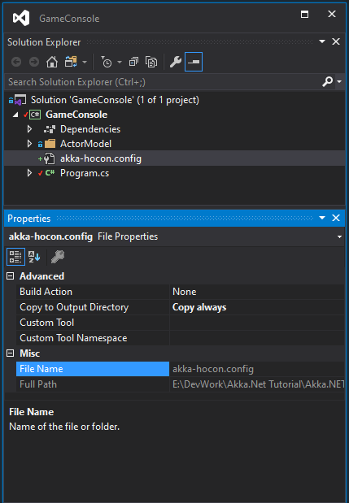

## What is it

I've been doing a lot of Pluralsight courses recently around Akka.NET, and whilst a majority (if not all) were released pre .NET Core days, as I was going through them I was targeting either .NET Core or .NET Standard.

For the most part this worked OK, the only minor stumbling point was when it came to using HOCON. Typically this would be added in the `app.config` file, however .NET core typically wants to use appsettings.

During doing some of these courses, I had to see if there was a way I could implement some hocon config.

I came across a solution on StackOverflow [here](https://stackoverflow.com/a/56459986/1798229).

I then decided as I've used it a few times it might be worth turning it into an extension, so here it is!

Hopefully someone might find it useful, but I'll guess time will tell!

## How to use

So, first things first, you need to create a file to hold your hocon config. Place this in the same project root as where you start your actor system, and give the file a name, EG `akka-hocon.config`.

In here, there needs to be an XML element before creating a couple of other XML nodes, prior to creating a hocon node which will have our hocon config in a CDATA block. An example file would look something like this:

```xml
<?xml version="1.0" encoding="utf-8" ?>
<configuration>
  <akka>
    <hocon>
      <![CDATA[
      akka {
        log-config-on-start = off
        loglevel = WARNING
        actor {
          debug {
            receive = on
            autoreceive = on
            lifecycle = on
            event-stream = on
            unhandled = on
          }
        }
      }
      ]]>
    </hocon>
  </akka>
</configuration>
```

Ensure you set this files `Copy to output directory` property to **Copy always**



Then we can do something like this

```csharp
using Akka.Actor;
using CJTech.Akka.Helps.HoconConfigReader;

class Program
{
    private static ActorSystem System { get; set; }

    static void Main(string[] args)
    {
        var config = new AkkaHoconConfigurationHelper().ReadHoconConfigFile($"{Directory.GetCurrentDirectory()}\\akka-hocon.config");
        System = ActorSystem.Create("Game", config);
    }
}
```

And its as simple as that.

Hope you might find this useful.
